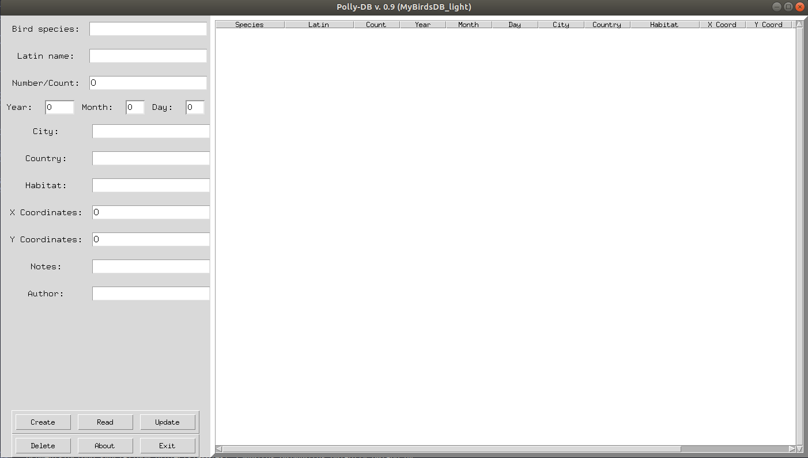

----------------------------- Work in Progress :octocat: -------------------------------
# myBirds
Project written in python focused on providing birdwatchers with desktop and web applications.

###### Polly_DB ->
__Currently under developemnt__ -> light and easy to use desktop app - consisting of a simple form and SQL database allowing to record and track bird sightings

###### myBirds_DB
__Feature stage__ :rocket: -> desktop and web app

